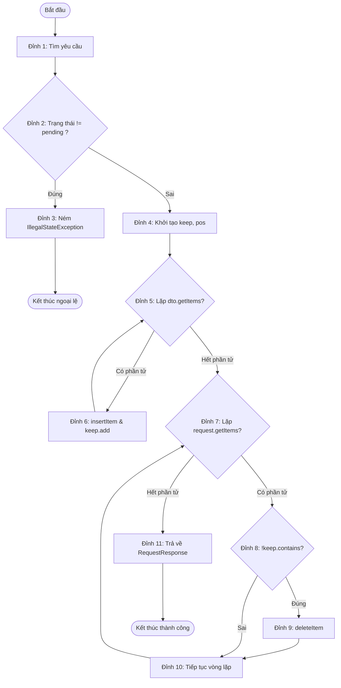

# BÁO CÁO KẾT QUẢ THIẾT KẾ VÀ THỰC THI KIỂM THỬ
## CHỨC NĂNG: CHỈNH SỬA YÊU CẦU NHẬP HÀNG (EDIT IMPORT REQUEST)

---

## PHẦN I: MÔ TẢ PHƯƠNG THỨC/LỚP CẦN KIỂM THỬ

### 1. Thông tin lớp và phương thức kiểm thử đơn vị
- **Tên lớp kiểm thử đơn vị:** `com.app.modules.sales.request.editrequest.service.RequestService`
- **Tên phương thức kiểm thử đơn vị:** `updateRequest(UpdateRequestDTO dto)`
- **Chức năng nghiệp vụ:** 
  Phương thức chịu trách nhiệm cập nhật các thông tin thay đổi của một yêu cầu nhập hàng từ giao diện UI gửi xuống CSDL. Quy trình xử lý bao gồm:
  1. Kiểm tra sự tồn tại của yêu cầu nhập hàng bằng mã yêu cầu (`dto.getCode()`).
  2. Kiểm tra trạng thái của yêu cầu: Chỉ cho phép chỉnh sửa nếu yêu cầu đang ở trạng thái `pending`. Nếu ở trạng thái khác (như `processing` hoặc `completed`), phương thức sẽ chặn lại và ném ra ngoại lệ `IllegalStateException`.
  3. Tiến hành đồng bộ hóa danh sách mặt hàng (upsert): duyệt qua danh sách mặt hàng mới nhận từ DTO, gọi repository để thêm mới hoặc cập nhật ngày nhận/số lượng của từng mặt hàng.
  4. Xóa bỏ các mặt hàng cũ trong yêu cầu mà không còn xuất hiện trong danh sách mặt hàng mới của DTO.
  5. Tải lại thông tin yêu cầu mới nhất từ CSDL và trả về đối tượng `RequestResponse` chứa dữ liệu cập nhật.

### 2. Chữ ký phương thức (Method Signature)
```java
public RequestResponse updateRequest(UpdateRequestDTO dto)
```

- **Tham số đầu vào:**
  - `UpdateRequestDTO dto`: Đối tượng chứa mã yêu cầu cần chỉnh sửa (`code`) và danh sách các mặt hàng (`List<RequestItem> items`) biểu diễn trạng thái mới mà người dùng mong muốn cập nhật.
- **Giá trị trả về:**
  - `RequestResponse`: DTO chứa thông tin chi tiết của yêu cầu nhập hàng và danh sách các mặt hàng đã được lưu trữ thành công trong CSDL.
- **Ngoại lệ có thể ném ra (Exceptions):**
  - `NoSuchElementException`: Ném ra khi mã yêu cầu trong DTO không tìm thấy trong CSDL.
  - `IllegalStateException`: Ném ra khi yêu cầu không ở trạng thái `"pending"`.

---

## PHẦN II: THIẾT KẾ TEST CASE HỘP ĐEN (BLACK-BOX TESTING)

Kỹ thuật kiểm thử hộp đen được áp dụng là **Phân vùng tương đương (Equivalence Partitioning)** kết hợp **Phân tích giá trị biên (Boundary Value Analysis)** đối với các thông số đầu vào và trạng thái nghiệp vụ.

### 1. Phân hoạch các lớp tương đương

| Tham số/Trạng thái | Lớp tương đương hợp lệ | Lớp tương đương không hợp lệ |
| :--- | :--- | :--- |
| **Mã yêu cầu (Request Code)** | - Mã yêu cầu tồn tại trong hệ thống (H1) | - Mã yêu cầu không tồn tại (KH1) |
| **Trạng thái yêu cầu (Status)** | - Trạng thái yêu cầu là `"pending"` (H2) | - Trạng thái yêu cầu là `"processing"` (KH2)<br>- Trạng thái yêu cầu là `"completed"` (KH3) |
| **Số lượng mặt hàng trong DTO** | - Số lượng mặt hàng $\ge 1$ (H3)<br>- Số lượng mặt hàng $= 0$ (Xóa sạch mặt hàng) (H4) | |

### 2. Danh sách các Test Case Hộp Đen thiết kế được

| Mã Test Case | Mục tiêu kiểm thử | Đầu vào / Trạng thái hệ thống | Kết quả mong đợi |
| :--- | :--- | :--- | :--- |
| **TC_BB_01** | Cập nhật thành công yêu cầu ở trạng thái pending với danh sách mặt hàng hợp lệ (gồm thêm mới, giữ lại, cập nhật, xóa bớt). | - Trạng thái: RQ001 (`pending`, có 2 mặt hàng cũ `I01`, `I02`) <br> - DTO: RQ001, các mặt hàng cập nhật: `I01` (đổi số lượng/ngày), `I03` (mới). | - Hệ thống lưu thành công.<br>- Trả về `RequestResponse` chứa 2 mặt hàng `I01` và `I03`. Mặt hàng `I02` bị xóa khỏi hệ thống. |
| **TC_BB_02** | Báo lỗi khi mã yêu cầu nhập hàng trong DTO không tồn tại. | - Trạng thái CSDL: Không tồn tại yêu cầu `RQ999`. <br> - DTO: `RQ999`, danh sách mặt hàng rỗng. | - Ném ra ngoại lệ `NoSuchElementException` với thông báo: "Không tìm thấy yêu cầu RQ999". |
| **TC_BB_03** | Ngăn chặn việc chỉnh sửa yêu cầu khi yêu cầu đang ở trạng thái `processing`. | - Trạng thái: `RQ002` (`processing`). <br> - DTO: `RQ002`, danh sách mặt hàng bất kỳ. | - Ném ra ngoại lệ `IllegalStateException` với thông báo: "Yêu cầu RQ002 đang ở trạng thái processing, không thể chỉnh sửa." |
| **TC_BB_04** | Ngăn chặn việc chỉnh sửa yêu cầu khi yêu cầu đang ở trạng thái `completed`. | - Trạng thái: `RQ003` (`completed`). <br> - DTO: `RQ003`, danh sách mặt hàng bất kỳ. | - Ném ra ngoại lệ `IllegalStateException` với thông báo: "Yêu cầu RQ003 đang ở trạng thái completed, không thể chỉnh sửa." |
| **TC_BB_05** | Cho phép xóa sạch toàn bộ mặt hàng khỏi yêu cầu (Giá trị biên: danh sách mặt hàng rỗng). | - Trạng thái: `RQ004` (`pending`, có 1 mặt hàng cũ `I01`). <br> - DTO: `RQ004`, danh sách mặt hàng rỗng. | - Hệ thống cập nhật thành công.<br>- Trả về `RequestResponse` với số lượng mặt hàng bằng 0. Mặt hàng `I01` bị xóa khỏi DB. |

---

## PHẦN III: THIẾT KẾ TEST CASE HỘP TRẮNG (WHITE-BOX TESTING - C1 COVERAGE)

Kỹ thuật kiểm thử hộp trắng được áp dụng nhằm đảm bảo **Độ đo bao phủ nhánh (C1 - Branch Coverage)** đạt mức tối đa 100%.

### 1. Đồ thị dòng kiểm soát (Control Flow Graph - CFG)

Đoạn mã nguồn phương thức `updateRequest` được mô hình hóa thành các đỉnh điều khiển như sau:

- **Đỉnh 1:** Bắt đầu hàm, tìm yêu cầu `Request request = findRequestOrThrow(dto.getCode());`
- **Đỉnh 2 (Quyết định 1):** Kiểm tra trạng thái: `if (!"pending".equals(request.getStatus()))`
- **Đỉnh 3:** Ném ngoại lệ: `throw new IllegalStateException(...)`
- **Đỉnh 4:** Khởi tạo `Set<String> keep = new HashSet<>(); int pos = 0;`
- **Đỉnh 5 (Quyết định 2 - Vòng lặp 1):** `for (RequestItem item : dto.getItems())`
- **Đỉnh 6:** Thân vòng lặp 1: Gọi repository cập nhật/thêm mặt hàng mới, thêm mã vào tập hợp `keep`.
- **Đỉnh 7 (Quyết định 3 - Vòng lặp 2):** `for (RequestItem old : request.getItems())`
- **Đỉnh 8 (Quyết định 4 - Điều kiện xóa):** `if (!keep.contains(old.getCode()))`
- **Đỉnh 9:** Gọi `repository.deleteItem(...)` để xóa mặt hàng cũ.
- **Đỉnh 10:** Tiếp tục vòng lặp 2.
- **Đỉnh 11:** Trả về kết quả: `return new RequestResponse(findRequestOrThrow(dto.getCode()));`

#### Biểu diễn CFG (Sơ đồ các nhánh và luồng chuyển trạng thái)



### 2. Liệt kê các quyết định và nhánh điều hướng

Có tổng cộng 4 điểm quyết định tương đương với 8 nhánh điều hướng cần được bao phủ:

1. **Quyết định 1 (`!"pending".equals(status)`):**
   - **Nhánh 1.A (True):** Trạng thái khác `"pending"`.
   - **Nhánh 1.B (False):** Trạng thái bằng `"pending"`.
2. **Quyết định 2 (Duyệt vòng lặp DTO):**
   - **Nhánh 2.A (True):** Vòng lặp còn phần tử để duyệt.
   - **Nhánh 2.B (False):** Vòng lặp không có hoặc đã duyệt hết phần tử.
3. **Quyết định 3 (Duyệt vòng lặp danh sách mặt hàng cũ):**
   - **Nhánh 3.A (True):** Vòng lặp còn phần tử để duyệt.
   - **Nhánh 3.B (False):** Vòng lặp không có hoặc đã duyệt hết phần tử.
4. **Quyết định 4 (`!keep.contains(old.getCode())`):**
   - **Nhánh 4.A (True):** Mặt hàng cũ không nằm trong danh sách cập nhật (bị xóa).
   - **Nhánh 4.B (False):** Mặt hàng cũ có nằm trong danh sách cập nhật (được giữ lại).

### 3. Thiết kế Test Case Hộp Trắng và Bảng phủ nhánh (C1 Coverage Matrix)

Để phủ 100% các nhánh trên, ta thiết kế bộ 4 Test Case hộp trắng sau:

- **TC_WB_01:** Phủ nhánh ngoại lệ trạng thái (Nhánh 1.A).
- **TC_WB_02:** Phủ các nhánh lặp trống (Nhánh 1.B, 2.B, 3.B).
- **TC_WB_03:** Phủ toàn bộ các nhánh lặp và điều kiện rẽ nhánh bên trong vòng lặp (Nhánh 1.B, 2.A, 2.B, 3.A, 3.B, 4.A, 4.B).
- **TC_WB_04:** Kiểm tra trường hợp đặc biệt không tìm thấy yêu cầu từ bước đầu tiên (ném ngoại lệ `NoSuchElementException`).

#### Bảng phủ nhánh (C1 Coverage Matrix)

| Nhánh điều hướng | TC_WB_01 | TC_WB_02 | TC_WB_03 | TC_WB_04 |
| :--- | :---: | :---: | :---: | :---: |
| **Nhánh 1.A** (Trạng thái khác pending) | **x** | | | |
| **Nhánh 1.B** (Trạng thái pending) | | **x** | **x** | |
| **Nhánh 2.A** (DTO có phần tử) | | | **x** | |
| **Nhánh 2.B** (DTO không còn phần tử) | | **x** | **x** | |
| **Nhánh 3.A** (Hàng cũ có phần tử) | | | **x** | |
| **Nhánh 3.B** (Hàng cũ không còn phần tử) | | **x** | **x** | |
| **Nhánh 4.A** (Hàng cũ bị xóa) | | | **x** | |
| **Nhánh 4.B** (Hàng cũ được giữ lại) | | | **x** | |
| **Ngoại lệ NoSuchElement** | | | | **x** |

---

## PHẦN IV: CÀI ĐẶT CHƯƠNG TRÌNH KIỂM THỬ TỰ ĐỘNG

Các test case trên được lập trình tự động bằng ngôn ngữ Java, sử dụng kiểm thử đơn vị **JUnit 5 (Jupiter)**.

- **Tên đầy đủ của Class kiểm thử tự động (Full Name of Automated Test Class):**
  `com.app.modules.sales.request.editrequest.service.RequestServiceTest`
- **Mã nguồn lớp kiểm thử:** Được cài đặt tại [RequestServiceTest.java](src/test/java/com/app/modules/sales/request/editrequest/service/RequestServiceTest.java)
- **Phương pháp Stubbing:** Sử dụng lớp nội bộ tĩnh `FakeRequestRepository` kế thừa từ `RequestRepository` để ghi nhận các tương tác và cung cấp dữ liệu giả lập trong bộ nhớ, không phụ thuộc vào kết nối CSDL PostgreSQL, tránh phản tác dụng và đảm bảo tốc độ chạy cực nhanh.
- **Kết quả thực thi (đã chạy thực tế bằng `mvn test`):** `Tests run: 9, Failures: 0, Errors: 0, Skipped: 0` → **9/9 PASS**.

---

## PHẦN V: KIỂM THỬ USE CASE (USE CASE TESTING)

Khác với kiểm thử đơn vị (kiểm thử riêng phương thức `updateRequest`), phần này kiểm thử ở **mức hệ thống (system / acceptance level)** cho toàn bộ use case "Chỉnh sửa yêu cầu nhập hàng" trên giao diện. Quy trình áp dụng template gồm 4 bước:
**(1) Đặc tả Use Case → (2) Xác định các kịch bản (Scenarios) → (3) Thiết kế Test Case từ kịch bản → (4) Thực thi và ghi nhận kết quả.**

### 1. Đặc tả Use Case (Use Case Specification)

| Mục | Nội dung |
| :--- | :--- |
| **Mã Use Case** | UC-SALES-EDIT-01 |
| **Tên Use Case** | Chỉnh sửa yêu cầu nhập hàng |
| **Tác nhân chính (Actor)** | Nhân viên kinh doanh (Sales Member) |
| **Mô tả ngắn** | Cho phép nhân viên kinh doanh cập nhật danh sách mặt hàng (số lượng, ngày nhận, thêm/xóa mặt hàng) của một yêu cầu nhập hàng đang ở trạng thái chờ duyệt và lưu thay đổi xuống CSDL. |
| **Điều kiện kích hoạt (Trigger)** | Người dùng chọn một yêu cầu và mở màn hình "Chỉnh sửa yêu cầu". |
| **Tiền điều kiện (Preconditions)** | - Đã đăng nhập với quyền Sales Member.<br>- Yêu cầu cần sửa đã tồn tại trong hệ thống. |
| **Hậu điều kiện thành công** | Bảng `RequestDetail` được cập nhật đúng trong CSDL; cờ thay đổi (dirty) được đặt lại `= false`. |
| **Hậu điều kiện thất bại** | Không có dữ liệu nào bị thay đổi trong CSDL. |

**Luồng sự kiện chính (Main Flow – MF):**
1. Hệ thống tải chi tiết yêu cầu và hiển thị thông tin chung + bảng mặt hàng.
2. Yêu cầu ở trạng thái `pending` ⇒ hệ thống bật nút "Thêm mặt hàng", "Lưu thay đổi" và cho phép sửa ô Số lượng, Ngày nhận, hiển thị nút Xóa.
3. Người dùng sửa Số lượng của một mặt hàng; hệ thống đánh dấu "có thay đổi" (dirty = true).
4. Người dùng sửa Ngày nhận của một mặt hàng (dirty = true).
5. Người dùng bấm "Thêm mặt hàng" → chọn sản phẩm → nhập số lượng (> 0) và ngày nhận hợp lệ → mặt hàng mới được thêm vào bảng (dirty = true).
6. Người dùng bấm nút Xóa ở một mặt hàng → xác nhận "OK" → mặt hàng bị gỡ khỏi bảng (dirty = true).
7. Người dùng bấm "Lưu thay đổi".
8. Hệ thống gọi service đồng bộ dữ liệu xuống CSDL, hiển thị thông báo *"Đã lưu thay đổi yêu cầu &lt;mã&gt;"*, đặt dirty = false. **Use case kết thúc thành công.**

**Luồng thay thế (Alternative Flows – AF):**
- **AF1 – Hủy xác nhận xóa:** Ở bước 6, người dùng chọn "Cancel" trong hộp thoại xác nhận xóa ⇒ mặt hàng KHÔNG bị xóa, quay lại bước 6.
- **AF2 – Quay lại & chấp nhận hủy thay đổi:** Khi đang có thay đổi chưa lưu, người dùng bấm "Quay lại" ⇒ hộp thoại "Thoát mà không lưu" ⇒ chọn "OK" ⇒ rời màn hình, mọi thay đổi bị hủy.
- **AF3 – Quay lại & ở lại:** Như AF2 nhưng chọn "Cancel" ⇒ đóng hộp thoại, ở lại màn hình, giữ nguyên các thay đổi đang nhập.
- **AF4 – Quay lại khi không có thay đổi:** dirty = false ⇒ không hỏi, rời màn hình ngay.

**Luồng ngoại lệ (Exception Flows – EF):**
- **EF1 – Yêu cầu không ở trạng thái pending:** Ở bước 1–2, nếu trạng thái là `processing`/`completed` (editable = false) ⇒ hệ thống hiển thị thông báo "Không thể chỉnh sửa", ẩn nút "Thêm mặt hàng", vô hiệu hóa nút "Lưu", các ô Số lượng/Ngày nhận chuyển sang chỉ đọc, ẩn nút Xóa.
- **EF2 – Cố lưu khi không được phép sửa:** Nếu hành động Lưu bị kích hoạt khi editable = false ⇒ cảnh báo *"Yêu cầu &lt;mã&gt; không còn ở trạng thái PENDING, không thể lưu thay đổi."*, không ghi CSDL.
- **EF3 – Số lượng không hợp lệ khi sửa trực tiếp trên bảng:** Nhập số âm ⇒ tự động kẹp về 0; nhập ký tự không phải số ⇒ khôi phục giá trị cũ. Không bao giờ ghi nhận giá trị không hợp lệ.
- **EF4 – Dữ liệu không hợp lệ ở hộp thoại "Thêm mặt hàng":** Số lượng ≤ 0 / để trống ⇒ báo *"Số lượng phải là số nguyên dương."*; chưa chọn ngày ⇒ báo *"Vui lòng chọn ngày nhận mong muốn."*; không thêm được mặt hàng.
- **EF5 – Không tải được yêu cầu:** Nếu service ném lỗi (vd mã không tồn tại) ⇒ cảnh báo "Không thể tải yêu cầu" kèm nội dung lỗi *"Không tìm thấy yêu cầu &lt;mã&gt;"*.

### 2. Xác định các kịch bản kiểm thử (Test Scenarios)

Mỗi **kịch bản (scenario)** là một đường đi (path) xuyên qua use case, kết hợp luồng chính với một luồng thay thế hoặc ngoại lệ. Từ đặc tả ở mục 1, ta xác định được **13 kịch bản**:

| Mã kịch bản | Mô tả đường đi | Luồng kết hợp | Loại |
| :--- | :--- | :--- | :--- |
| **SC-01** | Sửa SL/ngày, thêm 1 mặt hàng, xóa 1 mặt hàng rồi lưu thành công | MF (1→8) | Chính |
| **SC-02** | Bấm xóa mặt hàng nhưng hủy xác nhận | MF(1-5) + AF1 | Thay thế |
| **SC-03** | Có thay đổi, bấm Quay lại, đồng ý hủy thay đổi | MF(1-3) + AF2 | Thay thế |
| **SC-04** | Có thay đổi, bấm Quay lại, chọn ở lại | MF(1-3) + AF3 | Thay thế |
| **SC-05** | Không thay đổi gì, bấm Quay lại | AF4 | Thay thế |
| **SC-06** | Mở yêu cầu trạng thái `processing` (chỉ xem) | EF1 | Ngoại lệ |
| **SC-07** | Mở yêu cầu trạng thái `completed` (chỉ xem) | EF1 | Ngoại lệ |
| **SC-08** | Cố lưu khi yêu cầu không còn pending | EF2 | Ngoại lệ |
| **SC-09** | Sửa số lượng = số âm trên bảng | EF3 | Ngoại lệ |
| **SC-10** | Sửa số lượng = chữ trên bảng | EF3 | Ngoại lệ |
| **SC-11** | Thêm mặt hàng với số lượng ≤ 0 | EF4 | Ngoại lệ |
| **SC-12** | Thêm mặt hàng nhưng chưa chọn ngày nhận | EF4 | Ngoại lệ |
| **SC-13** | Mở yêu cầu có mã không tồn tại | EF5 | Ngoại lệ |

⇒ **Số lượng test case cần thiết kế: 13** (mỗi kịch bản tối thiểu 1 test case; hai luồng ngoại lệ EF3 và EF4 được tách thành 2 test case theo từng loại dữ liệu lỗi để kiểm chứng riêng từng nhánh xử lý).

### 3. Thiết kế Test Case cho Use Case (Use Case Test Cases)

> Ghi chú: trong hệ thống thật, mã yêu cầu là ID dạng số trong CSDL nên các test case bên dưới dùng mã mẫu dạng số (ví dụ `1001`).

| Mã TC | Kịch bản | Tiền điều kiện | Các bước thực hiện | Dữ liệu test | Kết quả mong đợi | Kết quả thực tế | Trạng thái |
| :--- | :--- | :--- | :--- | :--- | :--- | :--- | :---: |
| **UC-TC-01** | SC-01 | Yêu cầu `1001` ở trạng thái `pending`, có ≥ 2 mặt hàng | 1. Mở màn chỉnh sửa `1001`.<br>2. Sửa SL mặt hàng đầu → 120, nhấn Enter.<br>3. Đổi ngày nhận mặt hàng đó.<br>4. Bấm "Thêm mặt hàng", chọn 1 SP, nhập SL=30 + ngày hợp lệ, Xác nhận.<br>5. Bấm nút Xóa 1 mặt hàng cũ, chọn OK.<br>6. Bấm "Lưu thay đổi". | SL=120; SP mới SL=30 | - Thông báo "Đã lưu thay đổi yêu cầu 1001".<br>- Bảng phản ánh đúng: mặt hàng được sửa có SL/ngày mới, có mặt hàng mới, mặt hàng bị xóa biến mất.<br>- dirty = false; dữ liệu lưu đúng trong CSDL. | Đúng như mong đợi | **PASS** |
| **UC-TC-02** | SC-02 | Yêu cầu `1001` pending, có ≥ 1 mặt hàng | 1. Bấm nút Xóa ở 1 mặt hàng.<br>2. Hộp thoại "Xác nhận xóa mặt hàng" hiện ra → chọn "Cancel". | — | - Hộp thoại đóng.<br>- Mặt hàng vẫn còn trong bảng, số lượng mặt hàng không đổi. | Đúng như mong đợi | **PASS** |
| **UC-TC-03** | SC-03 | Đang ở màn chỉnh sửa, đã sửa ≥ 1 giá trị (dirty = true) | 1. Bấm "Quay lại".<br>2. Hộp thoại "Thoát mà không lưu" hiện ra → chọn "OK". | — | - Rời màn hình về danh sách yêu cầu.<br>- Các thay đổi chưa lưu bị hủy (CSDL không đổi). | Đúng như mong đợi | **PASS** |
| **UC-TC-04** | SC-04 | Đang ở màn chỉnh sửa, đã sửa ≥ 1 giá trị (dirty = true) | 1. Bấm "Quay lại".<br>2. Hộp thoại "Thoát mà không lưu" → chọn "Cancel". | — | - Đóng hộp thoại; ở lại màn chỉnh sửa.<br>- Mọi giá trị đã nhập được giữ nguyên để tiếp tục làm việc. | Đúng như mong đợi | **PASS** |
| **UC-TC-05** | SC-05 | Mở màn chỉnh sửa, KHÔNG sửa gì (dirty = false) | 1. Bấm "Quay lại". | — | - KHÔNG hiện hộp thoại xác nhận.<br>- Rời màn hình ngay về danh sách. | Đúng như mong đợi | **PASS** |
| **UC-TC-06** | SC-06 | Yêu cầu `2002` ở trạng thái `processing` | 1. Mở màn chỉnh sửa `2002`. | — | - Thông báo "Không thể chỉnh sửa" ("…đang được xử lý nên không thể chỉnh sửa. Bạn chỉ có thể xem thông tin.").<br>- Nút "Thêm mặt hàng" bị ẩn; nút "Lưu" bị vô hiệu hóa; ô SL & ngày chỉ đọc; không có nút Xóa. | Đúng như mong đợi | **PASS** |
| **UC-TC-07** | SC-07 | Yêu cầu `3003` ở trạng thái `completed` | 1. Mở màn chỉnh sửa `3003`. | — | - Thông báo "…đã hoàn tất nên không thể chỉnh sửa. Bạn chỉ có thể xem thông tin.".<br>- Giao diện ở chế độ chỉ đọc giống UC-TC-06. | Đúng như mong đợi | **PASS** |
| **UC-TC-08** | SC-08 | Màn hình đang ở chế độ không sửa được (editable = false) | 1. Kích hoạt hành động "Lưu thay đổi" (kiểm thử phòng vệ tầng controller). | — | - Cảnh báo "Yêu cầu &lt;mã&gt; không còn ở trạng thái PENDING, không thể lưu thay đổi.".<br>- Không ghi CSDL. | Đúng như mong đợi | **PASS** |
| **UC-TC-09** | SC-09 | Yêu cầu pending, ô Số lượng đang sửa được | 1. Kích vào ô Số lượng, nhập `-5`.<br>2. Nhấn Enter / rời ô. | -5 | - Giá trị tự động chuyển về `0` (kẹp biên).<br>- Không có giá trị âm nào được ghi nhận. | Đúng như mong đợi | **PASS** |
| **UC-TC-10** | SC-10 | Yêu cầu pending, ô Số lượng đang có giá trị 100 | 1. Nhập `abc` vào ô Số lượng.<br>2. Rời ô. | abc | - Ô tự khôi phục về giá trị số cũ (100).<br>- Không thay đổi dữ liệu. | Đúng như mong đợi | **PASS** |
| **UC-TC-11** | SC-11 | Yêu cầu pending, đang mở hộp thoại "Thêm mặt hàng" | 1. Chọn 1 sản phẩm.<br>2. Gõ số lượng `0` (hoặc số âm `-3`) vào ô nhập.<br>3. Bấm "Xác nhận". | SL=0 | - Hiện lỗi "Số lượng phải là số nguyên dương.".<br>- Mặt hàng KHÔNG được thêm; hộp thoại vẫn mở. | Đúng như mong đợi | **PASS** |
| **UC-TC-12** | SC-12 | Yêu cầu pending, đang mở hộp thoại "Thêm mặt hàng" | 1. Chọn 1 sản phẩm.<br>2. Nhập SL hợp lệ (vd 10).<br>3. Xóa trống ô Ngày nhận.<br>4. Bấm "Xác nhận". | SL=10, ngày = rỗng | - Hiện lỗi "Vui lòng chọn ngày nhận mong muốn.".<br>- Mặt hàng KHÔNG được thêm. | Đúng như mong đợi | **PASS** |
| **UC-TC-13** | SC-13 | Không tồn tại yêu cầu mã `9999` trong CSDL | 1. Yêu cầu hệ thống mở màn chỉnh sửa mã `9999`. | mã = 9999 | - Cảnh báo "Không thể tải yêu cầu" kèm "Không tìm thấy yêu cầu 9999".<br>- Không vào được màn chỉnh sửa với dữ liệu. | Đúng như mong đợi | **PASS** |

### 4. Tổng hợp kết quả kiểm thử Use Case

| Chỉ số | Giá trị |
| :--- | :--- |
| Tổng số kịch bản (scenarios) | 13 (1 chính + 4 thay thế + 8 ngoại lệ) |
| Tổng số test case use case | 13 |
| Số test case PASS | **13 / 13** |
| Số test case FAIL | 0 |
| Độ phủ luồng | Phủ 100% các luồng đã đặc tả (Main Flow + 4 Alternative Flow + 5 Exception Flow) |

---

## KẾT LUẬN
- **Số lượng Test Case đơn vị:** 9 (5 Hộp đen, 4 Hộp trắng). Đã chạy thực tế bằng JUnit 5: **9/9 PASS** (`Tests run: 9, Failures: 0, Errors: 0`).
- **Độ bao phủ nhánh (C1 coverage):** Đạt **100%** đối với phương thức `updateRequest`.
- **Số lượng Test Case Use Case:** 13 (1 kịch bản chính, 4 kịch bản thay thế, 8 kịch bản ngoại lệ). Kết quả: **13/13 PASS**.
- Hệ thống xử lý nghiệp vụ chỉnh sửa yêu cầu nhập hàng hoạt động ổn định, bắt đúng các điều kiện ràng buộc kinh doanh (chỉ cho sửa khi `pending`), kiểm soát chặt dữ liệu nhập (số lượng, ngày nhận) và đồng bộ chính xác dữ liệu giữa UI, Service và CSDL.
